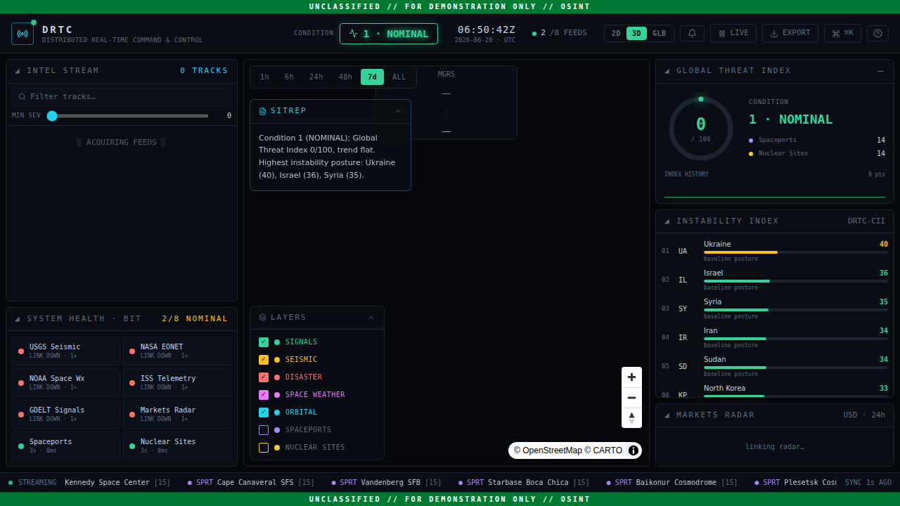

# DRTC — Distributed Real-Time Command & Control System

> A tactical, browser-based situational-awareness console that fuses live open
> data — seismic, natural-disaster, space-weather, orbital, geopolitical, and
> market feeds — into a single 3D command picture, a Global Threat Index, and a
> per-country Instability Index. **No API keys. No backend. Runs anywhere.**

DRTC is inspired by [worldmonitor](https://github.com/koala73/worldmonitor) and
rebuilt from scratch as a leaner, key-free, self-contained dashboard with a
command-and-control aesthetic and a correlation engine on top of the raw feeds.



---

## Features

- **Triple map engine — 2D · 3D · Globe**, switchable from the header (or
  keys `2` / `3` / `G`):
  - **2D WebGL map** (MapLibre GL) on a dark CARTO basemap, plotting every
    geolocated track as a severity-scaled circle with high-alert glow, hover
    tooltips, click-to-select, instability "zones", and zoom controls.
  - **3D terrain map** — the same live MapLibre basemap rendered on a true
    **globe projection** with **3D terrain relief** (AWS Terrain Tiles),
    atmospheric sky, and free tilt/rotate (drag, or the pitch control).
  - **Stylized globe** (`react-globe.gl` / Three.js) with pulse rings.
  - **Great-circle correlation arcs** link the most unstable watch-country to
    the high-severity tracks driving it — rendered in all map modes.
  - Engines are **lazy-loaded** — the heavy Three.js bundle only loads for the
    stylized globe.
- **Time-range filter** (`1h · 6h · 24h · 48h · 7d · ALL`) scoping every live
  layer on the map, globe, and intel feed.
- **Layer control panel** to toggle each data layer on/off (persisted).
- **Infrastructure reference layers** — curated Spaceports and Nuclear Power
  Plants, excluded from threat scoring and the time filter.
- **Country instability markers + correlation arcs** — Tier-1 watch nations are
  plotted on the globe colored by their live instability score, with animated
  arcs linking the most unstable country to the high-severity tracks driving it.
- **Live Intel Stream** — a unified, severity-ranked feed of all events with
  source tags, severity bars, and age, plus **full-text search** and a
  **minimum-severity slider** that filter both the list and the globe.
- **Global Threat Index + 5-tier Condition** (`NOMINAL → CRITICAL`) — a
  correlation engine scores the whole event stream and shows a live gauge with
  rising/falling trend and a rolling **index-history sparkline**.
- **DRTC Instability Index (CII)** — a proximity-weighted stress score for 20
  Tier-1 nations, combining a geopolitical baseline with nearby live events and
  surfacing the top drivers per country.
- **SITREP overlay** — a deterministic, rule-based intelligence brief
  synthesized live from the picture (no LLM, no keys).
- **Live alerts** — new severity ≥ 85 tracks raise dismissable toast alerts and
  a header badge; click an alert to jump to the track. A warm-up pass prevents
  the first historical batch from flooding the log.
- **Markets Radar** — live crypto majors with 24h moves.
- **Layer control & filters** — toggle any data layer from the globe legend or
  the command palette.
- **⌘K Command Palette** — keyboard-driven control of layers, focus, alerts,
  filters, and feeds.
- **Feed Integrity panel** — per-source health, latency, and last-sync, with
  graceful degraded/offline states.
- **Persisted preferences** — active layers, severity floor, view mode, and
  time range are saved to `localStorage` and restored on reload.
- **Pause/Resume**, live UTC clock, and a scrolling priority-event ticker.

## Defense-grade (C2) features

- **Classification banners** (top & bottom) in the operational
  `UNCLASSIFIED // FOR DEMONSTRATION ONLY // OSINT` format.
- **MGRS + lat/lon cursor HUD** — live Military Grid Reference System readout as
  you move over the 2D map.
- **Exportable products** — one-click **SITREP** (formatted Markdown report with
  DTG, condition, priority tracks, instability posture) and **COP** (JSON
  snapshot of the full common operating picture).
- **System Health / BIT panel** — built-in-test view with per-source status,
  latency sparklines, consecutive-failure counts, and an aggregate
  `N/M NOMINAL` readout.
- **Resilient ingest** — bounded retry with exponential backoff + jitter, and a
  per-source **circuit breaker** that backs a wedged feed off (up to 10 min)
  instead of hammering it.
- **Keyboard-driven ops** — `⌘K` palette, `Space` pause, `2`/`3` view switch,
  `?` help, `Esc` to clear, all documented in an in-app shortcuts overlay.

## Production engineering

- **Unit tests** (Vitest) covering the correlation engine, store reducers,
  filtering, alert warm-up, and utilities — `npm test`.
- **CI** (GitHub Actions): type-check → lint → format-check → tests → build on
  every push/PR to `main`.
- **Linting & formatting** — ESLint (typescript-eslint + react-hooks) and
  Prettier, enforced in CI.
- **Error boundaries** isolate every panel and the map engine so one failing
  widget can't black out the whole console.
- **Code-split & lazy-loaded** view engines; vendor chunks split
  (three / maplibre) for fast first paint.
- **Installable PWA** with offline app-shell caching and runtime basemap
  caching (works after first load without a network).

## Improvements over the original

| Area | worldmonitor | DRTC |
| --- | --- | --- |
| Setup | Many providers need keys / Ollama / edge functions | **Zero keys, zero backend** — static SPA |
| Data model | Per-feed | **Unified `IntelEvent`** normalization across all sources |
| Scoring | Country Instability Index | **Global Threat Index + Condition tiers + proximity-weighted CII correlation engine** |
| UI | Intelligence dashboard | **Command-&-control console** (threat conditions, feed integrity, ⌘K palette) |
| Footprint | Large monorepo (Tauri, proto, edge) | **Single Vite + React app**, deploys to any static host |

## Live data sources (all free, key-less, CORS-enabled)

| Layer | Source | Endpoint |
| --- | --- | --- |
| Seismic | USGS Earthquakes | `earthquake.usgs.gov` GeoJSON |
| Disaster | NASA EONET | `eonet.gsfc.nasa.gov` |
| Space Weather | NOAA SWPC | `services.swpc.noaa.gov` |
| Orbital | ISS (wheretheiss.at) | `api.wheretheiss.at` |
| Signals | GDELT GEO 2.0 | `api.gdeltproject.org` |
| Markets | CoinGecko | `api.coingecko.com` |

Each feed has its own refresh cadence (ISS every 5s, markets/seismic every 60s,
disasters every 5 min, etc.) and degrades independently if a source is down.

## Tech stack

React 18 · TypeScript · Vite · Tailwind CSS · Zustand · MapLibre GL (2D map) · react-globe.gl / Three.js (3D globe) · MGRS · lucide-react

Tooling: Vitest · ESLint · Prettier · vite-plugin-pwa · GitHub Actions.

Basemap: CARTO dark tiles (free, key-less) — © OpenStreetMap © CARTO.
Terrain: AWS Terrain Tiles (Terrarium DEM, free, key-less).

## Scripts

```bash
npm run dev          # dev server
npm run build        # type-check + production build (PWA)
npm run preview      # serve the production build
npm test             # watch-mode unit tests
npm run test:run     # one-shot unit tests
npm run lint         # eslint
npm run format       # prettier --write
npm run typecheck    # tsc --noEmit
```

## Getting started

```bash
npm install
npm run dev      # http://localhost:5173
```

```bash
npm run build    # type-check + production bundle to dist/
npm run preview  # serve the production build
```

> Note: the dashboard fetches all data directly from public APIs in the browser,
> so it needs internet access at runtime. No `.env` or keys are required.

## Architecture

```
src/
  services/        # one module per feed, each → normalized IntelEvent[]
    http.ts        #   fetch helper (timeout + latency)
    seismic.ts disasters.ts space.ts orbital.ts signals.ts markets.ts
    threat.ts      #   correlation engine: Threat Index + Country Instability
  hooks/useFeeds.ts# per-source polling/orchestration
  store.ts         # Zustand store (events, sources, threat, filters)
  components/       # Header, GlobeView, IntelFeed, ThreatPanel,
                   # InstabilityPanel, MarketTicker, SourceStatus,
                   # StatusBar, EventDetail, CommandPalette
  types.ts utils.ts App.tsx main.tsx
```

**Data flow:** `services/*` fetch & normalize → `useFeeds` ingests into the
Zustand `store` on each source's cadence → `threat.ts` recomputes the Global
Threat Index and per-country Instability scores → components render reactively.

### Extending DRTC

Add a new layer in three steps:

1. Create `src/services/<name>.ts` returning `{ events: IntelEvent[], latencyMs }`.
2. Register it in `src/hooks/useFeeds.ts` (`FEEDS` array) with a cadence.
3. Add it to `INITIAL_SOURCES` and `CATEGORY_META` in `src/store.ts`.

## Roadmap

- Cyber & aviation (OpenSky ADS-B) layers
- Optional local-LLM SITREP synthesis (Ollama/WebLLM) on top of the rule-based brief
- PWA offline shell + desktop packaging
- Saved watch lists and custom layouts

## License

MIT — see [LICENSE](LICENSE). Built on public open-data APIs; respect each
provider's terms and rate limits.
