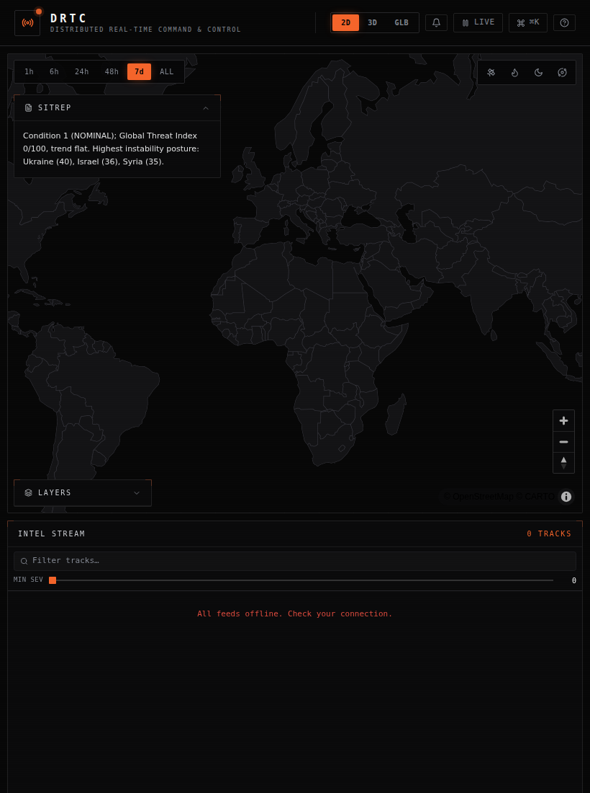
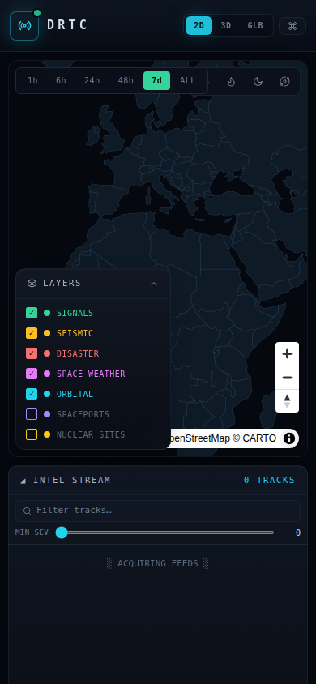

# DRTC

**Distributed Real-Time Command & Control System**

DRTC is a browser based situational awareness console. It pulls live open data
from a handful of public sources, plots everything on a world map (flat, 3D
terrain, or a globe), scores it into a single threat picture, and lets you work
the whole thing from the keyboard. There are no API keys to set up and no
backend to run. Open it and it starts streaming.


## What it does

- **One map, three views.** A 2D dark world map, a tilt-able 3D terrain map on a
  real globe projection, and a stylized globe. Switch with the header buttons or
  the keys `2`, `3`, `G`.
- **Live tracks.** Earthquakes, natural disasters, severe weather alerts, air
  quality, space weather, the ISS, and geopolitical signal hotspots are
  normalized into one event model and drawn as severity scaled points with hover
  details and click to focus.
- **Threat picture.** A correlation engine rolls the whole event stream into a
  Global Threat Index, a five level condition (NOMINAL up to CRITICAL), and a
  rolling history sparkline.
- **Instability index.** A proximity weighted stress score for 20 watch list
  countries, built from a geopolitical baseline plus nearby live events, with
  the top drivers called out per country.
- **Ground segment.** A live satellite pass planner. DRTC pulls fresh orbital
  elements for a tracked constellation, propagates them with SGP4, and works out
  every upcoming contact window over a worldwide ground station network. The
  schedule reads like a real tasking board: which bird, which station, time to
  acquisition, peak elevation, duration, RF band, and a rough downlink budget.
- **Conjunction screening.** The same constellation is screened pairwise for
  close approaches. For every pair it finds the time of closest approach, the
  miss distance, and the relative speed, and flags anything inside the alert
  threshold. It is a miniature version of the space-domain-awareness check real
  operators run before they trust a pass.
- **Contact scheduling.** A station antenna can service one contact at a time
  and a satellite can only talk to one station at once, so overlapping passes
  conflict. The schedule resolves the contention into a clean plan and marks
  each pass scheduled or held. The backend solves it optimally with an OR-Tools
  CP-SAT no-overlap model; the standalone app uses a fast greedy pass.
- **Intel stream.** A ranked feed of every event with full text search and a
  minimum severity slider that filter both the list and the map.
- **SITREP.** A plain language situation summary generated from the current
  picture. No model calls, just rules over the live data.
- **Alerts.** New high severity tracks raise a dismissable toast and a header
  badge. A warm up pass keeps the first batch of historical events from flooding
  the log.
- **Markets radar.** Live prices and 24h moves for the major coins.

## About the scores

The Global Threat Index and the Instability Index are **heuristics built for
demonstration, not real intelligence assessments.** They combine open-source
event severity and density with a fixed geopolitical baseline and a distance
falloff. The weights are hand-tuned to produce a readable picture, not validated
against any ground truth. Treat them as a way to rank and visualize the live
feed, nothing more. The UI labels both panels as heuristic for the same reason.

## Design

The interface is a flat, pure black command console: hairline-bordered panels,
sharp corners, mono type, and subtle HUD framing. There is one accent color
(orange) and one rule for everything else: **color encodes severity, not
category.** Tracks, bars, gauges, and rings all move along the same four step
scale, so a glance reads as threat level rather than a legend of hues.

```
NOMINAL  slate   ·  MODERATE  amber  ·  HIGH  orange  ·  CRITICAL  red
```

Type is shown by short codes (SEIS, DSTR, WX, NEO) and the layer panel, not by
color. The result is a disciplined two tone system instead of a rainbow. Motion
is restrained and respects `prefers-reduced-motion`.

## Map toolbar

The strip on the right edge of the map adds:

- **SAT** to swap the dark basemap for satellite imagery.
- **HEAT** for a density heatmap of the live picture.
- **DAY/NIGHT** for a real time day and night terminator, recomputed every
  minute.
- **ORBIT** to slowly spin the earth, which pauses the moment you grab the map.
- **RADAR** for a live precipitation overlay (RainViewer).
- **CLOUDS** for live infrared cloud cover (RainViewer satellite), rendered in
  the blue and white infrared palette.
- **GND** to draw the ground station network, the tracked spacecraft sub-points,
  and a link line for every station that is in contact right now.
- **RULER** to measure great circle range and bearing between points you click.

You also get a live MGRS and lat/lon readout under the cursor, a time range
filter (1h, 6h, 24h, 48h, 7d, ALL), a layer panel, great circle arcs that
connect the most unstable country to the events driving its score, and a live
**ISS ground track** that trails the station's recent path.

## More tools

- **Frame capture.** Export the current map view as a PNG from the Export menu,
  ready to drop into a report.
- **Audio alerts.** A speaker toggle in the header plays a short sonar tone when
  a new critical track appears, so you can run the board unattended.
- **Reports.** Export a formatted SITREP (Markdown) or the full common operating
  picture (JSON).

## Ground segment

The Ground Segment panel turns DRTC into a small mission planning aid. It tracks
a representative LEO constellation (the ISS, Hubble, Landsat 9, NOAA 20,
Sentinel-2A, and Aqua) and a worldwide ground station network spanning the major
commercial and agency providers (KSAT, Leaf Space, RBC Signals, AWS Ground
Station, NASA Near Earth Network, ESA Estrack, and Atlas).

Every minute it refreshes orbital elements when they go stale, runs an SGP4
propagation for each spacecraft over the next twelve hours, and steps the orbit
forward to find each contact window: the moments a bird climbs above a station's
elevation mask. Coarse 30 second sampling brackets each rise and set, then a
bisection refines acquisition and loss of signal to about a second, and a
ternary search pins the true peak elevation. For every pass it records peak
elevation, duration, the start and end azimuths, a first order downlink budget
from the station's best RF band, and a Doppler shift estimate at the carrier
frequency, which is the number an SDR or software modem has to chase.

The top of the panel is a sky track: an azimuth and elevation polar plot of the
selected pass, north up, horizon at the rim and zenith at the center, with the
acquisition, culmination, and loss points marked. Pick any pass in the schedule
to plot it. Contacts that are open right now are pulled to the top and counted as
live links, and selecting a station on the map filters the schedule to that site.

The pass engine is pure and time injected, so the whole thing is unit tested
against a known orbit rather than wall clock luck. The COMSEC line is a nod to
how these links actually run: encrypted and CCSDS framed.

## Works on any screen

The layout adapts from a three column command wall on desktop down to a single
scrolling column on phones, with the map leading and the panels stacked below.
The header trims itself as space gets tight so the important controls always fit.

| Tablet | Phone |
| --- | --- |
|  |  |

## Data sources

Everything here is free and needs no key.

| Layer | Source |
| --- | --- |
| Seismic | USGS earthquake feed |
| Disasters | NASA EONET |
| Weather alerts | NOAA / NWS (US) |
| Air quality | Open-Meteo (global cities) |
| Space weather | NOAA SWPC |
| ISS position | wheretheiss.at |
| Orbital elements (TLE) | CelesTrak via tle.ivanstanojevic.me |
| Signals | GDELT |
| Near-Earth objects | NASA NeoWs |
| Precipitation radar | RainViewer |
| Markets | CoinGecko |
| Basemap | CARTO dark tiles (OpenStreetMap data) |
| Satellite | Esri World Imagery |
| Terrain | AWS Terrain Tiles |

Each feed runs on its own refresh schedule, retries with backoff, and drops to a
circuit breaker if a source keeps failing so it does not hammer a dead endpoint.

## Running it

```bash
npm install
npm run dev
```

That starts the dev server (usually on http://localhost:5173). Build a
production bundle with `npm run build` and serve it with `npm run preview`.

The app fetches all of its data straight from the public APIs in the browser, so
it needs an internet connection at runtime. There is nothing required to
configure. The only optional setting is `VITE_NASA_KEY`: the NASA feed uses the
shared `DEMO_KEY` by default, and you can drop in your own free key from
api.nasa.gov for higher rate limits.

## Backend (optional)

The frontend runs fully standalone, but there is also a Python backend in
[`backend/`](backend) that turns DRTC into a real distributed system. Instead of
every browser polling a dozen APIs and running its own orbit propagation, the
backend polls each feed once for the whole fleet, runs SGP4 pass prediction
server-side, and fans the result out to all clients over a websocket. It is built
with FastAPI, httpx, Pydantic, and sgp4, with a clean split between the write path
(async ingest workers with per-source circuit breakers) and the read path (a
stateless gateway). See [ARCHITECTURE.md](ARCHITECTURE.md) for the full design,
and [backend/README.md](backend/README.md) to run it.

To connect the two, set `VITE_DRTC_API` to the backend URL at build time (see
`.env.example`). The frontend then opens a websocket, takes a full snapshot on
connect, and is driven by live deltas instead of its own pollers, with a BACKEND
LINK indicator in the status bar and auto-reconnect if the link drops. With no
URL set the app stays fully standalone, so the static deploy keeps working.

## Stack

React, TypeScript, Vite, Tailwind, Zustand for state, MapLibre GL for the 2D and
3D map, three.js (through react-globe.gl) for the stylized globe, and satellite.js
for SGP4 orbit propagation behind the ground segment. The map and globe engines
are loaded on demand so the first paint stays light. The build also ships as an
installable PWA with offline caching of the app shell and basemap.

The backend is Python: FastAPI, httpx, Pydantic v2, and sgp4, with an in-process
pub/sub broker (Redis-swappable) and a Docker Compose stack.

Tooling: Vitest for unit tests, ESLint and Prettier, and a GitHub Actions CI
workflow that type checks, lints, tests, and builds on every push.

## Engineering notes

A few things that go beyond a demo:

- **Resilient ingest.** Every feed has its own refresh cadence, retries with
  exponential backoff, and a per source circuit breaker that backs a failing
  source off (up to ten minutes) instead of hammering a dead endpoint. The
  System Health panel shows live latency, sync age, and failure counts.
- **Pure, tested parsers.** Each feed exposes a `parse()` function separate from
  its fetch, unit tested against real and malformed payloads, since upstream
  shape changes are the most likely break.
- **Isolation.** Error boundaries wrap every panel and the map engine, so one
  failing widget can't take down the console.
- **Graceful states.** Loading, all feeds offline, and empty filter results are
  all handled explicitly rather than showing a blank panel.

## Scripts

```bash
npm run dev          # dev server
npm run build        # type check and production build
npm run preview      # serve the production build
npm test             # unit tests in watch mode
npm run test:run     # unit tests once
npm run lint         # eslint
npm run typecheck    # tsc only, no emit
```

## How it is organized

```
src/
  services/        one file per feed (parse + fetch), plus the correlation
                   engine (threat.ts), shared geo math (geo.ts), and report
                   export (report.ts)
  hooks/useFeeds   feed polling, cadence, and the circuit breaker
  store.ts         app state (events, threat, filters, view mode, cursor)
  components/      header, panels, overlays
    map/           map style, layer defs, GeoJSON sources, toolbar
  *.test.ts        unit tests for the engine, store, and parsers
  types.ts         shared types
```

Data flow: `services/*` fetch and normalize into one `IntelEvent` model →
`useFeeds` ingests into the store on each source's cadence → `threat.ts`
recomputes the indices and SITREP → components render reactively.

Adding a layer is three steps: write a `parse()` plus `fetch()` in `services/`,
register it in `hooks/useFeeds.ts`, and add it to the source list and category
map in `store.ts`.

## License

MIT. See [LICENSE](LICENSE). Built on public open data, so check each provider's
terms and rate limits before you lean on them hard.
